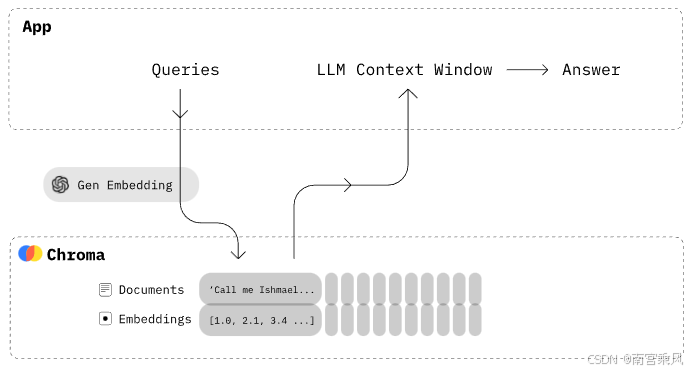
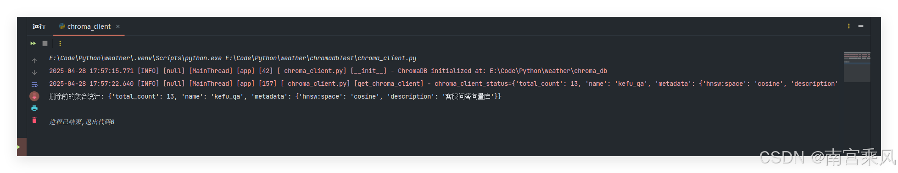
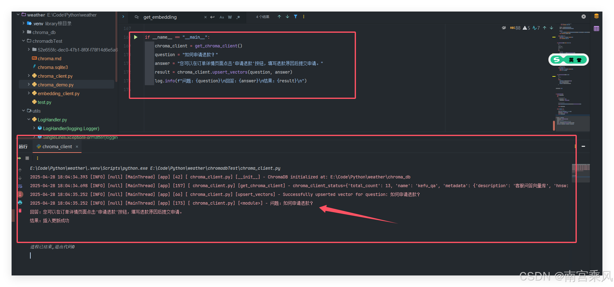
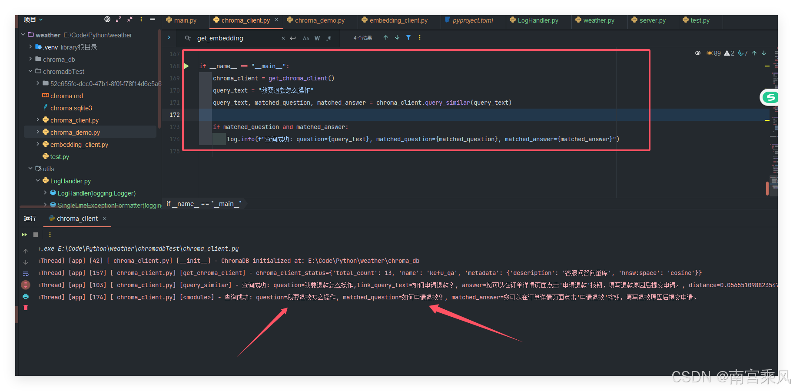
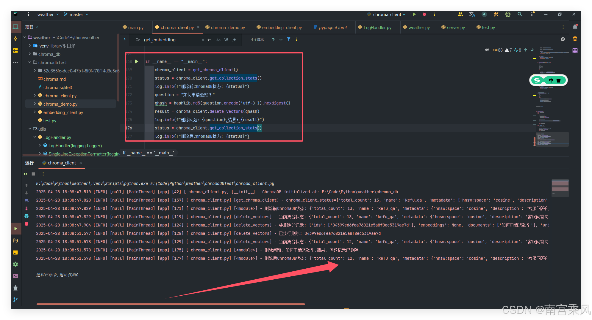
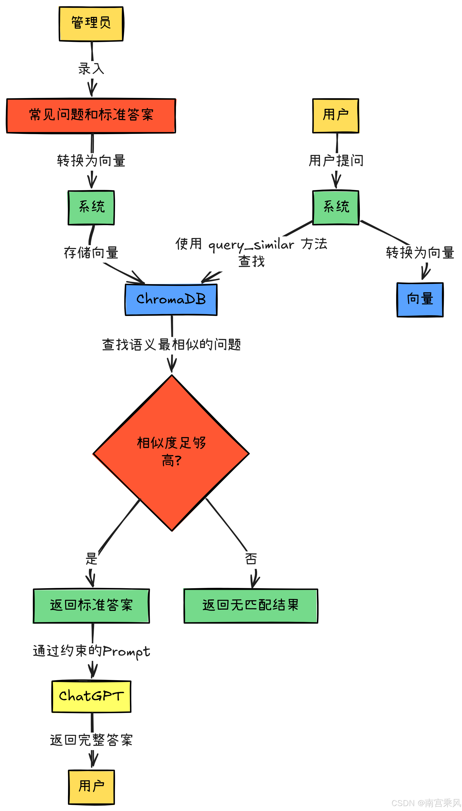

## 什么是向量库？

向量库（Vector Database）是一种专门设计用来存储和检索向量数据的数据库系统。在这个文件中使用的 ChromaDB 就是一种向量数据库。

向量库的核心概念：

1. 向量嵌入（Embeddings） ：将文本、图像等非结构化数据转换为高维数字向量
2. 相似性搜索 ：基于向量间的距离（如余弦相似度）快速查找相似内容
3. 高效索引 ：使用特殊的索引结构（如 HNSW）加速相似性搜索



## 向量库的用途

在这个项目中，向量库主要用于客服问答系统：

1. 知识库管理 ：存储问题和答案对，并将问题转换为向量形式存储
2. 语义搜索 ：当用户提问时，将问题转换为向量，在向量库中查找最相似的已存问题
3. 智能匹配 ：根据语义相似度而非简单的关键词匹配，找到最相关的答案

## Chroma 向量库实战

Chroma 是一个用于构建带有嵌入向量（vector embedding）的 AI 应用程序的向量数据库。它们可以表示文本、图像，很快还可以表示音频和视频。它内置了您开始使用所需的一切，并在您的计算机上运行。他是开源免费，可以本地部署，支持 python 和 js。这是他的优点。pinecone 则是付费，而且需要存储数据到 pinecone 服务器上面，这点对于数据比较重要的企业尤其不好，Chroma 则是存储在自己的服务器

ChromaDB 是一个开源的向量数据库，专门用于存储和检索向量数据。它特别适合构建语义搜索、问答系统等 AI 应用。本文将介绍如何使用 ChromaDB 实现基本的向量数据库操作，包括数据的增删改查。

## 环境准备

本示例使用了以下主要依赖：

- chromadb：向量数据库
- dashscope：文本向量化服务

```bash
pip install chromadb
pip install dashscope
```

```python

import chromadb
# chroma_client = chromadb.Client() #内存模式
# 数据保存在磁盘
client = chromadb.PersistentClient(path="E:\\Code\\Python\\weather\\chromadbTest")
collection = client.get_collection(name="fruit_collection")
# 插入数据
collection.add(
    documents=["This is a document about apples", "This is a document about oranges"],
    metadatas=[{"source": "web"}, {"source": "book"}],
    ids=["id1", "id2"]
)

```

## 客服向量库实战

### EmbeddingClient

`EmbeddingClient` 类负责将文本转换为向量表示。它使用单例模式确保全局只有一个实例，并通过 dashscope 服务进行文本向量化。

```python
class EmbeddingClient:
    def get_embedding(self, text: Union[str, List[str]]) -> List[float]:
        """获取文本的向量表示"""
        # 通过 dashscope 服务将文本转换为向量
        resp = dashscope.TextEmbedding.call(
            model=self.model,
            input=text
        )
        return resp.output['embeddings'][0]['embedding']
```

完整代码：
DashScope 是阿里云的一款模型服务产品，简化了 AI 模型的应用与部署。
已开通服务并获得 API-KEY：[开通 DashScope 并创建 API-KEY。](https://help.aliyun.com/zh/model-studio/obtain-api-key-app-id-and-workspace-id)

```python
from http import HTTPStatus
import dashscope
from typing import List, Union
from utils.LogHandler import log

# from conf.config import dashscope_api_key

dashscope_api_key = "sk-xxxxxxxxxxx"


class EmbeddingClient:
    _instance = None  # 用于保存单例对象

    def __new__(cls):
        """
        确保 `EmbeddingClient` 类只有一个实例（单例模式）
        """
        if cls._instance is None:
            cls._instance = super().__new__(cls)
            cls._instance._initialize()
        return cls._instance

    def _initialize(self):
        """
        初始化客户端连接
        """
        dashscope.api_key = dashscope_api_key
        self.model = dashscope.TextEmbedding.Models.text_embedding_v3

    def get_embedding(self, text: Union[str, List[str]]) -> List[float]:
        """
        获取文本的向量表示
        :param text: 输入文本，可以是字符串或字符串列表
        :return: 向量列表
        """
        try:
            resp = dashscope.TextEmbedding.call(
                model=self.model,
                input=text
            )
            if resp.status_code == HTTPStatus.OK:
                embedding = resp.output['embeddings'][0]['embedding']
                return embedding
            else:
                log.error(f"Embedding生成失败: status_code={resp.status_code}")
                raise Exception(f"Embedding生成失败: {resp.status_code}")
        except Exception as e:
            log.error(f"Embedding异常: {str(e)}")
            raise


# 获取 embedding_client 的方法
def get_embedding_client() -> EmbeddingClient:
    """
    获取EmbeddingClient实例
    :return: EmbeddingClient的单例对象
    """
    return EmbeddingClient()

```

### ChromaClient

`ChromaClient` 类封装了与 ChromaDB 的交互操作，提供了以下主要功能：

- 向量数据的插入和更新
- 相似向量查询
- 向量数据删除
- 集合统计信息查询

```python
import hashlib
import os
from datetime import datetime
from pathlib import Path
from typing import Optional, Tuple

import chromadb
from chromadb.config import Settings

from embedding_client import get_embedding_client
from utils.LogHandler import log


class ChromaClient:
    def __init__(self, persist_directory: str = None):
        """
        初始化Chroma客户端
        :param persist_directory: 持久化存储路径，默认为项目根目录下的chroma_db
        """
        if persist_directory is None:
            # 获取项目根目录
            root_dir = Path(__file__).parent.parent
            persist_directory = os.path.join(root_dir, "chroma_db")

        # 确保目录存在
        os.makedirs(persist_directory, exist_ok=True)
        # 修改初始化设置
        self.client = chromadb.PersistentClient(
            path=persist_directory,
            settings=Settings(
                anonymized_telemetry=False,
                is_persistent=True  # 显式指定持久化
            )
        )
        # 创建或获取集合
        self.collection = self.client.get_or_create_collection(
            name="kefu_qa",
            metadata={"hnsw:space": "cosine", "description": "客服问答向量库"}
        )
        self.embedding_client = get_embedding_client()
        from utils.LogHandler import log
        log.info(f"ChromaDB initialized at: {persist_directory}")

    def upsert_vectors(self, question: str, answer: str) -> str:
        """
        插入或更新向量
        :param question: 问题文本
        :param answer: 答案文本
        :return: 操作结果信息
        """
        qhash = hashlib.md5(question.encode('utf-8')).hexdigest()
        try:
            embedding = self.embedding_client.get_embedding(question)

            metadata = {
                "answer": answer,
                "timestamp": datetime.now().isoformat()
            }

            self.collection.upsert(
                ids=[qhash],
                embeddings=[embedding],
                documents=[question],
                metadatas=[metadata]
            )
            log.info(f"Successfully upserted vector for question: {question}")
            return "插入更新成功"
        except Exception as e:
            log.error(f"向量更新失败: {str(e)}", exc_info=True)
            return f"向量更新失败: {str(e)}"

    def query_similar(self, query_text: str, top_k: int = 1) -> Tuple[str, Optional[str], Optional[str]]:
        """
        查询相似向量
        :param query_text: 查询文本
        :param top_k: 返回结果数量
        :return: (查询文本, 匹配问题, 匹配答案)
        """
        try:
            query_embedding = self.embedding_client.get_embedding(query_text)
            results = self.collection.query(
                query_embeddings=[query_embedding],
                n_results=top_k,
                include=["documents", "metadatas", "distances"],
                where=None,  # 可选的过滤条件
                where_document=None  # 可选的文档过滤条件
            )

            # 检查结果是否为空
            if not results['ids'] or not results['ids'][0]:
                log.info(f"未找到匹配问题：{query_text}")
                return query_text, None, None

            # 获取相似度分数
            distance = results['distances'][0][0]
            if distance > 0.4:  # 相似度阈值，可根据需要调整
                log.info(f"找到的匹配相似度过低：{distance}")
                return query_text, None, None

            question = results['documents'][0][0]
            answer = results['metadatas'][0][0]['answer']

            log.info(
                f"查询成功: question={query_text},link_query_text={question}, answer={answer}, distance={distance}")
            return query_text, question, answer

        except Exception as e:
            log.error(f"查询失败: {str(e)}", exc_info=True)
            return query_text, None, None

    def delete_vectors(self, qhash: str) -> str:
        """
        根据问题删除向量
        :param qhash:
        :return: 删除结果信息
        """
        try:
            # 先检查集合中的数据
            log.info(f"当前集合状态: {self.get_collection_stats()}")
            # 尝试获取要删除的记录
            existing = self.collection.get(
                ids=[qhash]
            )
            log.info(f"要删除的记录: {existing}")
            self.collection.delete(
                ids=[qhash]
            )
            log.info(f"已执行删除: {qhash}")
            log.info(f"当前集合状态: {self.get_collection_stats()}")
            return "问题记录已删除"
        except Exception as e:
            log.error(f"删除失败: {str(e)}", exc_info=True)
            return f"删除失败: {str(e)}"

    def get_collection_stats(self) -> dict:
        """
        获取集合统计信息
        """
        return {
            "total_count": self.collection.count(),
            "name": self.collection.name,
            "metadata": self.collection.metadata
        }


_chroma_client = None


def get_chroma_client():
    global _chroma_client
    try:
        # 如果是第一次创建，或者需要重新检查状态
        if _chroma_client is None:
            _chroma_client = ChromaClient()

        # 获取集合统计信息进行更详细的状态检查
        log.info(f'chroma_client_status={_chroma_client.get_collection_stats()}')

        return _chroma_client

    except Exception as e:
        # 如果出现任何异常，记录日志并重新创建
        log.error(f"获取ChromaClient失败，重新创建对象: {e}")
        _chroma_client = ChromaClient()
        return _chroma_client


if __name__ == "__main__":
    chroma_client = get_chroma_client()
    stats = chroma_client.get_collection_stats()
    print(f"删除前的集合统计: {stats}")

```



### 日志记录器

```python
import os
import logging
from logging.handlers import TimedRotatingFileHandler

# 确定日志存储路径，确保路径存在
CURRENT_PATH = os.path.dirname(os.path.abspath(__file__))
ROOT_PATH = os.path.abspath(os.path.join(CURRENT_PATH, "..", "..", ".."))
# LOG_PATH = "/app/logs/app/"
LOG_PATH = os.path.join(ROOT_PATH, 'logs')
if not os.path.exists(LOG_PATH):
    os.makedirs(LOG_PATH)


# 自定义 Filter，用于确保日志 record 中包含 traceId 属性，不存在时设为默认 "null"
class TraceIdFilter(logging.Filter):
    def filter(self, record):
        if not hasattr(record, "traceId"):
            record.traceId = "null"
        return True


# 自定义 Formatter，用于将异常信息中的换行符替换为分隔符，使异常信息显示为单行
class SingleLineExceptionFormatter(logging.Formatter):
    def formatException(self, exc_info):
        result = super().formatException(exc_info)
        # 将换行符替换为空格或其他分隔符，例如 " | "
        return result.replace('\n', ' | ')


# 定义日志格式与时间格式（模仿 Java 输出格式）
LOG_FORMAT = '%(asctime)s.%(msecs)03d [%(levelname)s] [%(traceId)s] [%(threadName)s] [%(name).36s] [%(lineno)d] [ %(filename)s] [%(funcName)s] - %(message)s'
DATE_FORMAT = '%Y-%m-%d %H:%M:%S'


class LogHandler(logging.Logger):
    def __init__(self, name, level=logging.INFO, use_stream=True, use_file=True):
        super().__init__(name, level)
        self.name = name
        self.level = level

        # 添加 filter，确保 traceId 不为空
        self.addFilter(TraceIdFilter())

        if use_stream:
            self.__setStreamHandler__()
        if use_file:
            self.__setFileHandler__()

    def __setFileHandler__(self, level=None):
        # 日志文件名：LOG_PATH 下，名称为 {logger_name}.log
        file_name = os.path.join(LOG_PATH, f'{self.name}.log')
        # 使用按天滚动（每日一个文件），保留7天的日志
        file_handler = TimedRotatingFileHandler(filename=file_name, when='D', interval=1, backupCount=7,
                                                encoding="utf-8")
        file_handler.suffix = '%Y%m%d.log'
        file_handler.setLevel(level if level is not None else self.level)
        formatter = SingleLineExceptionFormatter(LOG_FORMAT, datefmt=DATE_FORMAT)
        file_handler.setFormatter(formatter)
        self.file_handler = file_handler
        self.addHandler(file_handler)

    def __setStreamHandler__(self, level=None):
        stream_handler = logging.StreamHandler()
        stream_handler.setLevel(level if level is not None else self.level)
        formatter = SingleLineExceptionFormatter(LOG_FORMAT, datefmt=DATE_FORMAT)
        stream_handler.setFormatter(formatter)
        self.addHandler(stream_handler)

    def resetName(self, name):
        self.name = name
        self.removeHandler(self.file_handler)
        self.__setFileHandler__()


project_name = 'app'
# 初始化 logger，级别设置为 DEBUG
log = LogHandler(project_name, level=logging.DEBUG)

# 使用示例：设置项目名称为 "app" 并初始化日志实例
if __name__ == '__main__':

    # 测试日志输出
    log.info('This is a test message')

    # 模拟异常情况，测试异常打印为单行
    try:
        1 / 0
    except Exception as e:
        # 这里使用 extra 参数传入 traceId，如果不传则默认显示 "null"
        log.exception("An error occurred", extra={"traceId": "trace-123"})

```

## 完整示例

`chroma_demo.py`

提供了一个完整的示例脚本 `chroma_demo.py`，展示了向量数据库的基本操作：

1. 添加示例问答对数据
2. 进行相似问题查询
3. 删除指定的问答对
4. 查看集合统计信息

```python
import os
from chroma_client import get_chroma_client


def demo_chroma_operations():
    # 获取ChromaDB客户端实例
    chroma_client = get_chroma_client()

    # 1. 添加示例数据
    print("\n1. 添加示例数据")
    qa_pairs = [
        ("如何查询订单物流？",
         "登录账号后进入『我的订单』，点击对应订单的『物流详情』即可查看实时快递信息，若未更新可联系承运商查询。"),
        ("今日有什么限时优惠？", "今天是2025年4月28日，周一会员日可享全场9折，部分商品参与『五一提前购』活动，满300减50。"),
        ("商品签收后发现有破损怎么办？",
         "请于签收后48小时内拍照留存证据，通过订单页面提交『售后申请』，我们将优先处理您的补偿或换货需求。"),
        ("如何修改绑定的手机号？", "在账户设置的『安全中心』中验证原手机号后，可直接输入新手机号并接收验证码完成更换。"),
        ("积分会过期吗？", "积分有效期为1年，每年12月31日清零未使用的积分，当前账户积分可在『会员中心』查看到期时间。"),
        ("五一假期期间发货吗？", "2025年五一假期为5月1日至5日，期间仓库暂停发货，4月30日18:00前的订单将尽量节前发出。"),
        ("如何开具电子发票？", "下单时勾选『需要发票』并填写抬头信息，电子发票将在订单完成后72小时内发送至您的邮箱。"),
        ("新用户有哪些福利？", "首次注册可领取100元优惠券包（含3张券），首单满199元还可额外获得双倍积分。"),
        ("忘记密码如何重置？", "在登录页点击『忘记密码』，通过绑定的手机号或邮箱接收验证码，按指引设置新密码即可。"),
        ("今日下单何时能到货？",
         "当前时间为17:27，今日内下单且选择快递配送，同城预计4月30日前送达，异地需3-5个工作日（五一假期可能延迟）。")
    ]

    for question, answer in qa_pairs:
        result = chroma_client.upsert_vectors(question, answer)
        print(f"问题：{question}\n回答：{answer}\n结果：{result}\n")

    # # 2. 查询相似问题
    print("\n2. 查询相似问题示例")
    test_queries = [
        "我要退款怎么操作",
        # "订单地址写错了怎么改",
        # "几点发货"
    ]
    #
    for query in test_queries:
        query_text, matched_question, matched_answer = chroma_client.query_similar(query)
        print(f"\n用户问题：{query_text}")
        if matched_question and matched_answer:
            print(f"匹配问题：{matched_question}")
            print(f"匹配答案：{matched_answer}")
        else:
            print("未找到匹配的问答对")
    #
    # 3. 删除示例
    print("\n3. 删除示例")
    # 获取第一个问题的hash值
    import hashlib
    question_to_delete = qa_pairs[0][0]
    qhash = hashlib.md5(question_to_delete.encode('utf-8')).hexdigest()

    # 删除前查看统计信息
    print("删除前统计：", chroma_client.get_collection_stats())

    # 执行删除
    result = chroma_client.delete_vectors(qhash)
    print(f"删除问题：{question_to_delete}")
    print(f"删除结果：{result}")

    # 删除后查看统计信息
    print("删除后统计：", chroma_client.get_collection_stats())


if __name__ == "__main__":
    demo_chroma_operations()

```

## 基本操作示例

### 1. 插入/更新向量数据

```python
# 插入问答对
question = "如何申请退款？"
answer = "您可以在订单详情页面点击'申请退款'按钮，填写退款原因后提交申请。"
result = chroma_client.upsert_vectors(question, answer)
```



### 2. 查询相似问题

```python
# 查询相似问题
query_text = "我要退款怎么操作"
query_text, matched_question, matched_answer = chroma_client.query_similar(query_text)

if matched_question and matched_answer:
    print(f"匹配问题：{matched_question}")
    print(f"匹配答案：{matched_answer}")
```



### 3. 删除向量数据

```python
# 删除指定问题的向量数据
    chroma_client = get_chroma_client()
    status = chroma_client.get_collection_stats()
    log.info(f"删除前ChromaDB状态: {status}")
    question = "如何申请退款？"
    qhash = hashlib.md5(question.encode('utf-8')).hexdigest()
    result = chroma_client.delete_vectors(qhash)
    log.info(f"删除问题：{question},结果：{result}")
    status = chroma_client.get_collection_stats()
    log.info(f"删除后ChromaDB状态: {status}")
```



## 实际应用场景

在客服系统中，这个向量库的应用流程大致为：

1. 管理员预先录入常见问题和标准答案
2. 系统将问题转换为向量并存储在 ChromaDB 中
3. 用户提问时，系统将问题转换为向量
4. 使用 query_similar 方法在向量库中查找语义最相似的问题
5. 如果找到相似度足够高的匹配（距离小于 0.4），返回对应的标准答案
6. 在把答案 通过约束的 Prompt 给 ChatGPT 回答
7. ChatGPT 返回更完整的答案，发送给用户
   这种基于向量的匹配方式比传统的关键词匹配更智能，能够理解问题的语义而非仅仅是字面表达，大大提高了自动问答系统的准确性和用户体验。



## 注意事项

1. 向量相似度阈值设置：

   - 当前示例中相似度阈值设置为 0.4，可以根据实际需求调整
   - 阈值越小，匹配要求越严格

2. 持久化存储：

   - ChromaDB 默认将数据存储在项目根目录的 `chroma_db` 文件夹中
   - 可以通过 `persist_directory` 参数自定义存储路径

3. 错误处理：
   - 示例代码中包含了基本的错误处理机制
   - 建议在生产环境中添加更完善的错误处理和重试机制

参考文档：
https://zhuanlan.zhihu.com/p/658217843
https://www.cnblogs.com/rude3knife/p/chroma_tutorial.html
